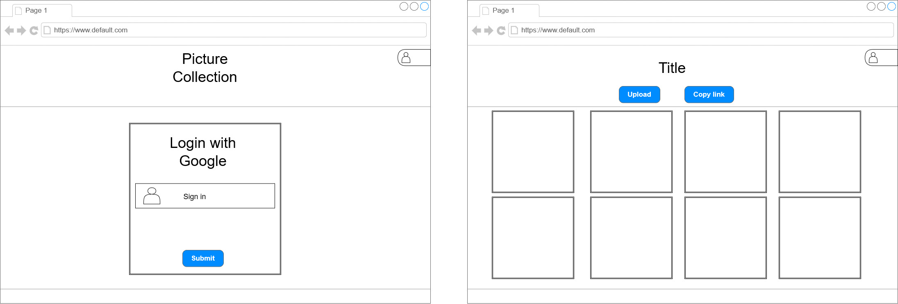
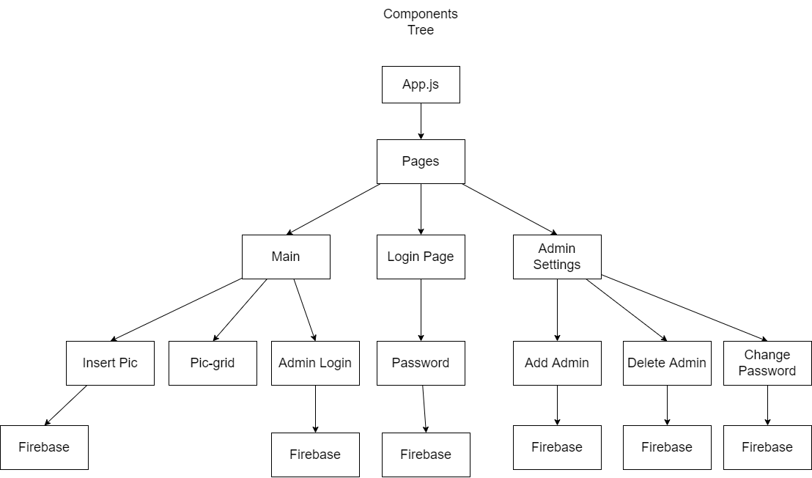

# Konzept

## Beschreibung

Meine Grundidee ist es eine online Bildergalerie zu machen bei der man Bilder hochladen kann. Diese Bilder kann man dann auch anklicken, um sie in gross anzuschauen. Zudem möchte ich es passwortgeschützt machen mit einem Admin der dieses Passwort ändern , wie auch neue bilder hochladen kann. Falls ich noch vörig Zeit haben werde möchte ich noch verschiedene Alben implementieren.

## Technologien

- React
- CSS / Tailwind
- Firebase

## Neu zu lernende Techniken

- Tailwind
- Firebase

## Use Cases

## Risiken

Ich denke die einzigen Risiken, die ich habe, sind dass ich mit React noch zu wenig geschickt umgehen kann oder das Firebase zu schwierig ist. Ausserdem habe ich noch wenig Erfahrung mit Logins. Aber ich denke zuversichtlich das ich das Schaffen werde.

## Konzept für das UI mit Wireframes oder Mockups und Flow-Chart

## Konzept für die Umsetzung in Form eines Klassendiagramms, Struktur der Applikation, Files

## Arbeitspakete

[Github Projects](https://github.com/yutive/picture-collection/projects/1)

## Zeitplanung